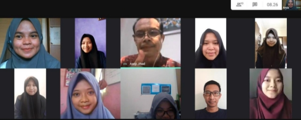

**LAPORAN AKHIR KEGIATAN** 

**PRAKTIK PENGALAMAN LAMPANGAN SEKOLAH DEKAT RUMAH (PPL-SDR) SMA NEGERI 1 CIKIJING** 

Dosen Pembimbing Lapangan : Drs. H. Asep Jihad, M.Pd       Guru Pamong : 

Suryadi, S. Pd., M.Pd 

Oleh : 

Nuri Krisdayani Amini  (1172050075) 

**PROGRAM STUDI PENDIDIKAN MATEMATIKA FAKULTAS TARBIYAH DAN KEGURUAN 
UNIVERSITAS ISLAM NEGERI**  

**SUNAN GUNUNG DJATI** 

**BANDUNG** 

**2020** 

**KATA PENGANTAR** 

Puji dan syukur penulis panjatkan kepada Allah SWT.,Tuhan semesta alam yang telah memberikan Rahmat dan Karunia-Nya sehingga penulis dapat menyelesaikan Laporan Akhir Praktik Pengalaman Lapangan Sekolah Dekat Rumah (PPL-SDR) di SMAN 1 Cikijing. Shalawat dan  salam  semoga  tercurah limpah  kepada  Baginda  Rasulullah  Muhammad  SAW.  Tak  lupa kepada keluarganya, kepada para sahabatnya,dan semoga sampai kepada umat akhir zaman. 

Praktik Pengalaman Lapangan sekolah dekat rumah (PPL-SDR) merupakan salah satu program di Fakultas Tarbiyah dan Keguruan bentuk pengabdian mahasiswa terhadap pendidikan selaku  calon  pendidik,  juga  ladang  dimana  penulis  dapat  mengaplikaskan  segala  ilmu  yang didapatkan selama bangku perkuliahan. Kegiatan Praktik Pengalaman Lapangan sekolah dekat rumah (PPL-SDR) ini berlangsung selama kurang lebih dua bulan, terhitung sejak 1 Oktober – 30 November 2020.  

Selama melaksanakan PPL-SDR, penulis mendapat bimbingan dan bantuan dari berbagai pihak sehingga program ini berjalan dengan lancar. Dalam penyusunan laporan ini, tentu tidak lepas dari pengarahan dan bimbingan dari berbagai pihak. Maka penulis ucapkan rasa hormat dan  terimakasih  kepada  semua  pihak  yang  telah  membantu.  Pihak-pihak  yang  terkait  yaitu 

diantaranya: 

1. Bapak Drs. H. Asep Jihad, M.Pd sebagai Dosen Pembimbing Lapangan (DPL) 
1. Ibu Dra. Hj. Yani Malihah sebagai Kepala Sekolah SMA Negeri 1 Cikijing 
1. Bapak Suryadi, S.Pd., M.Pd sebagai Guru pamong 
1. Seluruh guru dan staff SMA Negeri 1 Cikijing 
1. Seluruh siswa dan siswa kelas X IPA SMA Negeri 1 Cikijing 
1. Teman-teman seperjuangan PPL-SDR UIN Sunan Gunung Djati Bandung 

Sekian yang dapat penyusun sampaikan. Tentu, laporan ini jauh dari kata sempurna. Oleh karena  itu,  saran  dan  kritik  yang  membangun  penulis  harapkan.  Mohon  maaf  jika  dalam penyusunan  laporan  ini  masih  terdapat  banyak  kekeliruan,  baik  dalam  penulisan  maupun penyajian materi. Semoga,laporan ini dapat memberikan manfaat.Terimakasih. 

Majalengka, 08 Desember 2020 Penulis 

**DAFTAR ISI** 

[KATA PENGANTAR ..................................................................................................................... i ](#_page2_x69.00_y72.00)[DAFTAR ISI ................................................................................................................................... ii ](#_page3_x69.00_y72.00)[DAFTAR TABEL .......................................................................................................................... iv ](#_page5_x69.00_y72.00)[DAFTAR GAMBAR ...................................................................................................................... v ](#_page6_x69.00_y72.00)[BAB I .............................................................................................................................................. 1](#_page8_x69.00_y72.00)

[PENDAHULUAN .......................................................................................................................... 1](#_page8_x69.00_y88.00)

1. [Latar Belakang ................................................................................................................. 1](#_page8_x69.00_y130.00)
1. [Tujuan............................................................................................................................... 2](#_page9_x69.00_y424.00)
1. [Manfaat............................................................................................................................. 2](#_page9_x69.00_y528.00)

[BAB II ............................................................................................................................................. 4](#_page11_x69.00_y72.00)

[KONDISI OBJEKTIF SEKOLAH ................................................................................................. 4](#_page11_x69.00_y88.00)

1. [KONDISI UMUM............................................................................................................ 4](#_page11_x69.00_y104.00)
1. [Profil Sekolah ............................................................................................................... 4](#_page11_x69.00_y130.00)
1. [Struktur Organisasi Sekolah ......................................................................................... 6](#_page13_x69.00_y98.00)
1. [Sarana dan Prasarana Sekolah ...................................................................................... 6](#_page13_x69.00_y338.00)
1. [Perangkat Administrasi Pembelajaran .......................................................................... 7](#_page14_x69.00_y385.00)
1. [Program Pembinaan dan Pengembangan Peserta Didik ............................................... 8](#_page15_x69.00_y241.00)
1. [Prestasi Sekolah ............................................................................................................ 8](#_page15_x69.00_y371.00)
2. [KONDISI KHUSUS PEMBELAJARAN ........................................................................ 9](#_page16_x69.00_y72.00)
1. [Masalah-masalah Pembelajaran ................................................................................... 9](#_page16_x69.00_y88.00)
1. [Faktor-faktor Pemicu Masalah ..................................................................................... 9](#_page16_x69.00_y548.00)

[BAB III ......................................................................................................................................... 11](#_page18_x69.00_y72.00)

[TEMUAN DAN PEMBAHASAN ............................................................................................... 11](#_page18_x69.00_y88.00)

1. [TEMUAN ....................................................................................................................... 11](#_page18_x69.00_y104.00)
1. [PEMBAHASAN ............................................................................................................ 11](#_page18_x69.00_y245.00)

[BAB IV ......................................................................................................................................... 13](#_page20_x69.00_y72.00)

[PENUTUP..................................................................................................................................... 13](#_page20_x69.00_y88.00)

1. [Simpulan......................................................................................................................... 13](#_page20_x69.00_y104.00)
1. [Saran ............................................................................................................................... 13](#_page20_x69.00_y378.00)

[LAMPIRAN DOKUMENTASI ................................................................................................... 14](#_page21_x69.00_y72.00)

**DAFTAR TABEL** 

[Table 1 Daftar Kelas ....................................................................................................................... 5 ](#_page12_x69.00_y466.00)[Table 2 Jumlah Siswa ..................................................................................................................... 5 ](#_page12_x69.00_y635.00)[Table 3 Struktur Organisasi Sekolah .............................................................................................. 6 ](#_page13_x69.00_y114.00)[Table 4 Sarana dan Prasarana ......................................................................................................... 6 ](#_page13_x69.00_y354.00)[Table 5 Administrasi Perangkat Pembelajaran ............................................................................... 7 ](#_page14_x69.00_y401.00)[Table 6 Prestasi Sekolah ................................................................................................................. 8](#_page15_x69.00_y387.00)

**DAFTAR GAMBAR** 

[Gambar 1Bersama Teman Praktikan. Dari Kiri Imam (B.Arab), Windi (Kimia), Nuri (Matematika), Dudi (Fisika) ......................................................................................................... 14 ](#_page21_x69.00_y390.00)[Gambar 2 Denah SMAN 1 Cikijing.............................................................................................. 14 ](#_page21_x69.00_y702.00)[Gambar 3 Bersama Siswa/i Kelas X MIPA 1B ............................................................................ 15 ](#_page22_x69.00_y293.00)[Gambar 4 Bersama Siswa/i Kelas X MIPA 2B ............................................................................ 15 ](#_page22_x69.00_y490.00)[Gambar 5 Bersama Siswa/i Kelas X MIPA 3A ............................................................................ 15 ](#_page22_x69.00_y690.00)[Gambar 6 Penyerahan Plakat dan Piagam Penghargaan Kepada Pihak Sekolah (Kepala Sekolah) ....................................................................................................................................................... 16 ](#_page23_x69.00_y379.00)[Gambar 7 Penutupan dengan Pihak Sekolah ................................................................................ 16 ](#_page23_x69.00_y693.00)[Gambar 8 Penyerahan Sertifikat Kepada Guru Pamong............................................................... 17](#_page24_x69.00_y419.00)

[Gambar 9 Penutupan dengan Dosen Pembimbing Lapangan ....................................................... 17 ](#_page24_x69.00_y628.00)[Gambar 10 Pelaksanaan Ngawas PAS .......................................................................................... 18](#_page25_x69.00_y345.00)

v 

**BAB I  
PENDAHULUAN**  

1. **Latar Belakang** 

   Fakultas  Tarbiyah dan  Keguruan  UIN  Sunan  Gunung  Djati Bandung adalah salah satu  Lembaga Pendidikan  Tenaga  Keguruan di Indonesia  yang memiliki  tugas pokok  melatih mahasiswa agar memiliki kemampuan sebagai  tenaga pendidik  (guru) dan menghasilkan guru  yang profesional.  Peranan  Fakultas  Tarbiyah dan  Keguruan (FTK) dalam menyiapkan guru  yang berkualitas akan berkontribusi  dalam meningkatkan pula kualitas pendidikan di Indonesia. 

   Untuk  mendukung peran  tersebut,  FTK  memasukkan mata  kuliah Praktik  Pengalaman  Lapangan (PPL) dalam  kurikulum fakultas dan wajib diambil  setiap mahasiswa  jurusan pendidikan sebelum menyelesaikan masa studinya dikarenakan PPL adalah kegiatan praktik yang penting bagi setiap calon pendidik  profesional  untuk  mematangkan dan memproses mereka dalam jabatan yang akan disandangnya  kelak  sebagai  tenaga pendidik. 

   Seiring dengan pandemi  Covid-19  yang berdampak  pada semua bidang kehidupan,  tak  terkecuali  dalam bidang pendidikan,  maka  FTK  mendesain program PPL  khusus masa  Covid-19  dengan  istilah PPL-SDR  (Praktik Pengalaman  Lapangan Sekolah  Dekat  Rumah) dengan  tujuan agar mahasiswa dapat  mengikuti  PPL  walaupun dalam masa pandemic  ini  sehingga dapat menyelesaikan studinya tepat waktu. 

   Pelaksanaan  PPL-SDR  meliputi  (a) observasi  lokasi  praktik,  (b) perencanaan pengajaran,  (c) pelaksanaan pengajaran,  (d) ujian,  (e) pelibatan  mahasiswa  dalam  kegiatan  seolah,  dan  (f)  penyusunan  laporan 

   kegiatan.  

   Program Praktik Pengalaman Lapangan Sekolah Dekat Rumah (PPL-SDR) ialah kegiatan pembelajaran untuk membekali mahasiswa mencapai kompetensi keterampilan dalam  merencanakan,  melaksanakan,  mengevaluasi  pembelajaran  riil  dalam  situasi pandemic Covid-19 di sekolah/madrasah terdekat dimana praktikan tinggal. Bentuk PPL- SDR bagi praktikan yang berasal dari jurusan/prodi keguruan adalah melaksanakan tugas- tugas  keguruan  berupa  kegiatan  merencakan,  melaksanakan  dan  mengevaluasi pembelajaran, dan terlibat dalam kegiatan sekolah dalam penanganan masa Covid-19. Dalam melaksanakan PPL-SDR, sasaran yang hendak dicapai adalah terbentuknya jiwa pendidik yang berkompeten, memiliki rasa tanggung jawab terhadap tugas serta dapat mengaplikasikan  ilmu  itu  sebagai  tenaga  pengajar  dalam  bentuk  pengabdian.  Serta terbentuknya wawasan dan pengalaman mahasiswa sebagai calon guru dalam mendidik dan melakukan tugas-tugas keguruan yang lainnya. Diharapkan dari PPL-SDR tersebut para calon guru yang memiliki kompetensi personal, sosial dan professional

   Dalam kegiatan PPL-SDR ini, setiap praktikan harus selalu mendapat bimbingan  dari  guru  pamong  dan  dosen  pembimbing  lapangan.  Dengan proses  tersebut  diharapkan  mahasiswa  memperoleh  keterampilan  yang memadai   sesuai  dengan  tuntutan profesi  yang disandangnya baik  di  masa normal  ataupun dalam situasi  pandemic Covid-19.

2. **Tujuan**  

   PPL-SDR  bertujuan  pembekalan  mahasiswa  untuk  dunia  lapangan  pendidikan sekolah.  Pengenalan  dengan  nyata  pencapaian  kompetensi  keterampilan  dalam merencanakan, melaksanakan dan mengevaluasi dilingkungan sekolah. 

3. **Manfaat** 

   Pelaksanaan  Praktik  Pengalaman  Lapangan  diharapkan  dapat  memberikan manfaat  bagi  semua  komponen  yang  terkait  yaitu  mahasiswa  praktikan,  sekolah,  dan perguruan tinggi yang bersangkutan. 

1. Manfaat bagi Mahasiswa Praktikan 
1) Dapat  mengaplikasikan  materi-materi  yang  diperoleh  selama  di  bangku perkuliahan melalui proses pengajaran yang dibimbing oleh guru pamong di dalam kelas.  
2) Dapat memberikan bekal yang menunjang tercapainya penguasaan kompetensi yang  harus  dimiliki  oleh  seorang  guru  seperti  kompetensi  pedagogik, kepribadian, profesional, dan sosial.  
2) Dapat memahami secara langsung kegiatan dan kegiatan pendidikan lainnya disekolah latihan.  
2) Dapat mendewasakan cara berpikir dan meningkatkan daya nalar mahasiswa dalam melakukan penelaahan, perumusan, dan pemecahan masalah pendidikan yang ada di sekolah.  
2. Manfaat bagi Pihak Sekolah 
1) Dapat meningkatkan profesionalisme guru di dalam proses belajar mengajar. 
1) Dapat membantu sekolah dalam hal kegiatan belajar mengajar, terutama bagi mata pelajaran yang kekurangan guru. 
3. Manfaat bagi Universitas 
1) Dapat  menjalin  kerjasama  yang  baik  dengan  sekolah-sekolah  tempat mahasiswa  praktik  yang  bermuara  pada  peningkatan  mutu  dan  kualitas pendidikan di Indonesia. 
1) Dapat memperoleh masukan tentang pendidikan yang dipakai sebagai bahan pertimbangan penelitian. 
1) Dapat  menghasilkan  mahasiswa  unggul  dalam  kemampuan  mengajar  serta dapat  memenuhi standar kelulusan sarjana pendidikan bagi mahasiswanya. 

**BAB II**  

**KONDISI OBJEKTIF SEKOLAH** 

1. **KONDISI UMUM** 
1. Profil Sekolah 

Nama Sekolah : SMA Negeri 1 Cikijing 

Berdiri Tahun : 1998 

Pendiri   : - 

Status   : Negeri 

SK Pendirian : 0695/I.02.17/PR/1998 

NSS : 301021605028 

Luas Tanah  : 10.000 M2 

Nomor Sertifikat  : - 

Akreditasi Terakhir Th/Nilai  : 2016/A 

Kepala Sekolah : Dra. Hj. Yani Malihah 

Jalan : Jl. Dewi Sartika No.07 

Desa/Kelurahan : Sukasari 

Kecamatan  : Cikijing 

Kabupaten  : Majalengka 

Provinsi  : Jawa Barat 

Telephon/Fax : (0233) 317169/317170 

Kode Pos : 45466 

E-mail : [smancikijing1@gmail.com ](mailto:smancikijing1@gmail.com)

Web-site : smanegeri1cikijing.sch.id 

- Visi : 

“ Agamis, bercitra wawasan wiyata mandala, unggul dalam prestasi, ramah dengan lingkungan, tertib administrasi, profesional dalam pelayanan. ” 

- Misi : 

Untuk mencapai VISI tersebut, SMA Negeri 1 Cikijing mengembangakan Misi sebagai berikut :  

1. Membina dan menumbuh kembangkan peserta didik berlandaskan keimanan dan ketakwaan. 
2. Mewujudkan sekolah sebagai Wawasan Wiyata Mandala. 
2. Mewujudkan sekolah sebagai lingkungan pendidikan yang bercitra nyaman, rindang, asri dan aman. 
2. Mengembangkan wawasan dan pengetahuan peserta didik guna melanjutkan pendidikan yang lebih tinggi. 
2. Meningkatkan kemampuan sebagai anggota masyarakat dalam mengadakan hubungan timbal balik dengan lingkungan sekitarnya 
2. Meraih  prestasi  guna  meningkatkan  citra  sekolah  baik  KBM  maupun ekstrakurikuler 
2. Melakukan  pembaharuan  dalam  semangat  kekeluargaan  dan  suasana 

   demokratis. 

- Motto Hidup Sekolah  

D  = Datang dan Pulang Tepat Waktu 

I  = Itikad yang Baik 

S  = Santun Bersikap 

I  = Ikhlas Pengabdian 

P  = Pro Aktif dan Kooperatif 

L  = Loal dan Responsif 

I  = Inspiratif dalam Pengembangan Guru 

N  = Nama Baik Almamater selalu di Pelihara 

- Daftar Kelas dan Jumlah Siswa 

**Table 1 Daftar Kelas** 

|No |Nama Rombel |No |Nama Rombel |
| - | - | - | - |
|1 |X MIPA 1 |9 |XI IPS 1 |
|2 |X MIPA 2 |10 |XI IPS 2 |
|3 |X MIPA 3 |11 |XI IPS 3 |
|4 |X IPS 1 |12 |XII MIPA 1 |
|5 |X IPS 2 |13 |XII MIPA 2 |
|6 |X IPS 3 |14 |XII IPS 1 |
|7 |XI MIPA 1 |15 |XII IPS 2 |
|8 |XI MIPA 2 |16 |XII IPS 3 |

**Table 2 Jumlah Siswa** 

|**Rombel**  |**Jumlah Putra** |**Jumlah Putri** |**Jumlah** |
| - | - | - | - |
|Kelas X |79 |112 |191 |
|Kelas XI |51 |97 |148 |
|Kelas XII |70 |84 |154 |
|Jumlah |493 |||

2. Struktur Organisasi Sekolah 

**Table 3 Struktur Organisasi Sekolah** 

|**No** |**Nama** |**Jabatan** |
| - | - | - |
|1  |Dra. Hj. Yani Malihah |Kepala Sekolah |
|2  |Drs. Junanda, M. Pd. |Waka Sapras |
|3  |Dewi Susanti Kaniawati, M.Pd |Waka Sekur |
|4  |Drs. AS. Hidayat, M. A. |Waka Humas |
|5  |Abas Ali Sadikin, S. Pd. |Waka Kesiswaan |
|6  |JOJO, S.IP |Kasubag TU |
|7 |E. Subhan Umar, A.Md. |Sarana dan Prasarana |
|8 |Rika Hodijah, S. Pd. |Keuangan |
|9 |Leny Marlyna, A.Ma. |Kesiswaan |
|10 |Lalang Ahmad Mubarok |Kurikulum |
|11 |Heru Trisdiantoro, S.Pd. |Kepegawaian |
|12 |Dini Sri Wahyuni |Persuratan dan Pengarsipan |

3. Sarana dan Prasarana Sekolah 

**Table 4 Sarana dan Prasarana** 

|**No** |**Bangunan/Ruang/Lapangan** |**Banyak** |**Luas (m2)** |
| - | - | - | - |
|1 |Kelas |16 |72 |
|2 |Laboratorium Bahasa |1 |240 |
|3 |Laboratorium Kimia |1 |240 |
|4 |Laboratorium Fisika |1 |360 |
|5 |Laboratorium Biologi |1 |360 |
|6 |Laboratorium Geografi |- |- |
|7 |Laboratorium Komputer |1 |72 |
|8 |Laboratorium Sejarah |- |- |
|9 |Laboratorium Ekonomi |- |- |
|10 |Perpustakaan |1 |96 |
|11 |Lapang Upacara |1 |952 |
|12 |Lapangan Bola Voly |1 |394 |
|13 |Lapangan Bulu Tangkis |- |- |
|14 |Lapangan Footsal |1 |432 |
|15 |Lapangan Tenis Lantai |1 |324 |
|16 |Lapangan Basket |1 |432 |
|17 |Ruang Tenis Meja |1 |- |
|18 |Ruang Kepala Sekolah  |1 |42 |
|19 |Ruang Wakil Kepala Sekolah |2 |25 |
|20 |Ruang Guru |1 |87 |
|21 |Ruang Tata Usaha |1 |106 |
|22 |Ruang Bimbingan Konseling |1 |21 |
|23 |Ruang Rapat Unsur Pimpinan Sekolah |- |- |

|**No** |**Bangunan/Ruang/Lapangan** |**Banyak** |**Luas (m2)** |
| - | - | - | - |
|24 |Ruang Kesehatan/PMR/UKS |1 |16 |
|25 |Ruang OSIS |1 |32 |
|26 |Ruang Ganti Pakaian Siswa |- |- |
|27 |Ruang Satpam |1 |8 |
|28 |Sekretariat Ekstrakurikuler |- |- |
|29 |Aula |- |- |
|30 |Masjid |1 |135 |
|31 |Koperasi Siswa |1 |12 |
|32 |Koperasi Guru |- |- |
|33 |Kantin Sehat |4 |16 |
|34 |WC Kepala Sekolah |- |- |
|35 |WC Guru |6 |12 |
|36 |WC Siswa |6 |12 |
|37 |Gudang Barang Siap Pakai |- |- |
|38 |Gudang Barang Bekas Pakai |1 |6 |
|39 |Taman Sekolah |2 |351 |
|40 |Taman Baca |- |- |
|41 |Area Parkir Kendaraan Guru |1 |154 |
|42 |Area Parkir Kendaraan Siswa |1 |108 |

4. Perangkat Administrasi Pembelajaran  

**Table 5 Administrasi Perangkat Pembelajaran** 

<table><tr><th colspan="1" rowspan="2">No. </th><th colspan="1" rowspan="2">Perangkat Pembelajaran </th><th colspan="2">Keterangan </th></tr>
<tr><td colspan="1">Ada </td><td colspan="1">Tidak Ada </td></tr>
<tr><td colspan="1">1 </td><td colspan="1">Silabus </td><td colspan="1">V </td><td colspan="1"></td></tr>
<tr><td colspan="1">2 </td><td colspan="1">Kalender Pendidikan </td><td colspan="1">V </td><td colspan="1"></td></tr>
<tr><td colspan="1">3 </td><td colspan="1">Pogram Tahunan </td><td colspan="1">V </td><td colspan="1"></td></tr>
<tr><td colspan="1">4 </td><td colspan="1">Program Semester </td><td colspan="1">V </td><td colspan="1"></td></tr>
<tr><td colspan="1">5 </td><td colspan="1">RPP </td><td colspan="1">V </td><td colspan="1"></td></tr>
<tr><td colspan="1">6 </td><td colspan="1">Rencana Pelaksanaan Harian </td><td colspan="1">V </td><td colspan="1"></td></tr>
<tr><td colspan="1">7 </td><td colspan="1">Buku Pelaksanaan Harian </td><td colspan="1">V </td><td colspan="1"></td></tr>
<tr><td colspan="1">8 </td><td colspan="1">Presensi Siswa </td><td colspan="1">V </td><td colspan="1"></td></tr>
<tr><td colspan="1">9 </td><td colspan="1">Catatan Hambatan Belajar Siswa </td><td colspan="1">V </td><td colspan="1"></td></tr>
<tr><td colspan="1">10 </td><td colspan="1">Daftar Buku Pegangan Guru Dan Siswa </td><td colspan="1">V </td><td colspan="1"></td></tr>
<tr><td colspan="1">11 </td><td colspan="1">Analisis KKM </td><td colspan="1">V </td><td colspan="1"></td></tr>
<tr><td colspan="1">12 </td><td colspan="1">Kisi-Kisi Soal </td><td colspan="1">V </td><td colspan="1"></td></tr>
<tr><td colspan="1">13 </td><td colspan="1">Soal-Soal Ulangan </td><td colspan="1">V </td><td colspan="1"></td></tr>
<tr><td colspan="1">14 </td><td colspan="1">Buku Informasi Penilaian </td><td colspan="1">V </td><td colspan="1"></td></tr>
<tr><td colspan="1">14 </td><td colspan="1">Analisis Butir Soal </td><td colspan="1">V </td><td colspan="1"></td></tr>
<tr><td colspan="1">16 </td><td colspan="1">Analisis Hasil Ulangan </td><td colspan="1">V </td><td colspan="1"></td></tr>
<tr><td colspan="1">17 </td><td colspan="1">Program/Pelaksanaan Perbaikan </td><td colspan="1">V </td><td colspan="1"></td></tr>
<tr><td colspan="1">18 </td><td colspan="1">Program/Pelaksanaan Pengayaan </td><td colspan="1">V </td><td colspan="1"></td></tr>
<tr><td colspan="1">19 </td><td colspan="1">Daftar Pengembalian Hasil Ulangan </td><td colspan="1"></td><td colspan="1">V </td></tr>
</table>

<table><tr><th colspan="1" rowspan="2">No. </th><th colspan="1" rowspan="2">Perangkat Pembelajaran </th><th colspan="2">Keterangan </th></tr>
<tr><td colspan="1">Ada </td><td colspan="1">Tidak Ada </td></tr>
<tr><td colspan="1">20 </td><td colspan="1">Buku Ulangan Bergilir </td><td colspan="1"></td><td colspan="1">V </td></tr>
<tr><td colspan="1">21 </td><td colspan="1">Daftar Nilai </td><td colspan="1">V </td><td colspan="1"></td></tr>
<tr><td colspan="1">22 </td><td colspan="1">Laporan Penilaian Akhlak Mulia dan Kepribadian Siswa </td><td colspan="1">V </td><td colspan="1"></td></tr>
<tr><td colspan="1">23 </td><td colspan="1">Buku Tugas Terstruktur </td><td colspan="1">V </td><td colspan="1"></td></tr>
<tr><td colspan="1">24 </td><td colspan="1">Buku Tugas Mandiri </td><td colspan="1">V </td><td colspan="1"></td></tr>
<tr><td colspan="1">25 </td><td colspan="1">SK Pembagian Tugas </td><td colspan="1">V </td><td colspan="1"></td></tr>
<tr><td colspan="1">26 </td><td colspan="1">Jadwal Mengajar </td><td colspan="1">V </td><td colspan="1"></td></tr>
</table>
5. Program Pembinaan dan Pengembangan Peserta Didik 

Pembinaan  dan  pengembangan  peserta  didik  dimuat  dalam  berbagai  macam 

kegiatan  intra  dan  ekstrakurikuler  di  SMAN  1  Cikijing,  diantaranya  MPK,  OSIS, PASKIBRA,  PRAMUKA,  PMR,  PKS,  Pencinta  Alam,  Rohis,  Club  Olahraga, dan Seni.  Namun,  pada  masa  pendemi,  Covid-19  kegiatan  intra  dan  ekstrakurikuler  di SMAN 1 Cikijing tidak berjalan sebagaimana mestinya (non aktif). 

6. Prestasi Sekolah  

**Table 6 Prestasi Sekolah** 

|No |Nama Kegiatan |Capaian |Tingkat |Tahun |
| - | - | - | - | - |
|1 |SSS CUP III UNIKU |Juara 1 |Kabupaten/kota |2018 |
|2 |Biologi CUP III UNIKU |Juara 1 |Kabupaten/kota |2018 |
|3 |OSN Geografi |Juara 3 |Kabupaten |2018 |
|4 |FL2SN kategori Puisi |Juara 2 |Kabupaten |2018 |
|5 |Pencak Silat |Juara 1 |Provinsi |2018 |
|6 |O2SN / Pencak Silat |Juara 1 |Kabupaten |2018 |
|7 |Pencak Silat/ Rektor CUP UNIKU |Juara 2 |Kabupaten/Kota |2018 |
|8 |Pencak Silat/ pakubumi IV |Juara 1 |Asia Tenggara |2019 |
|9 |GTK Berprestasi TK KCD 9 DISDIK |Juara 1 |Provinsi |2019 |
|10 |Delegasi guru Indonesia ke jepang |- |Nasional |2016 |
|11 |Karya tulis |Juara 1 |ASEAN |2017 |

2. **KONDISI KHUSUS PEMBELAJARAN** 
1. Masalah-masalah Pembelajaran  

Proses pembelajaran di SMA Negeri 1  Cikijing terkena dampak dari adanya 

pandemi Covid-19. Pandemi Covid-19 yang merugikan ini melumpuhkan beberapa sektor salahsatunya pendidikan.  

Pembelajaran  ketika  masa  pandemi  di  SMA  Negeri  1  Cikijing  tahun  ajaran 2020/2021 dilakukan secara luring (luar jaringan) dan daring (dalam jaringan). Ketika luring atau tatap muka siswa diperkenankan masuk ke wilayah sekolah atau belajar dikelas dengan maksimal 15 siswa dalam satu kelas sehingga dalam satu kelas dibagi menjadi dua kelas, namun pembelajaran luring ini dilakukan secara bergantian setiap rombel perminggunya. Pembelajaran luring ini dilakukan sesuai protokol kesehatan, yaitu pengecekkan suhu sebelum masuk sekolah,cuci tangan sebelum masuk kelas dan diwajibkan memakai masker ketika pembelajaran berlangsungpun.  Berbeda dengan pembelajaran daring yang menggunakan *WhatsApp Group.* 

Adapun permasalahan yang ditemukan pada proses pembelajaran selama PPL- SDR berlangsung, diantaranya sebagai berikut. 

1) Proses pembelajaran daring sulit mengontrol peserta didik 
1) Pendidik  kebingungan  apakah  peserta  didik  mengerti  atau  tidak  dalam pembelajaran. 
1) Pembelajaran daring peserta didik tidak semua menyimak. 
1) Pendidik dan peserta didik membahas materi tidak maksimal. 
2. Faktor-faktor Pemicu Masalah 

Faktor-faktor  pemicu  masalah  dalam  proses  PPL-SDR  ketika  pembelajaran 

berlangsung pada kacamata praktikan diantaranya sebgai berikut. 

Proses pembelajaran ketika daring sulit mengontrol peserta didik, karena ketika pembelajaran berlangsung tidak semua merespon. Ketika memberi materi hanya ada beberapa yang menjawab „Waalaikumsalam, iya bu‟ selebihnya peserta didik tidak merespon  daam  hal  materi,  pada  saat  ditanya  mengenai  materi  tidak  ada  yang merespon.  Sehingga  pendidik  merasa  kebingungan  apakah  anak  didik  nya  sudah paham dan mengerti terhadap materi yang disampaikan atau tidak. 

Faktor  lainnya  yang  sama  ditemukan  ketika  pembelajaran  daring  yaitu  tidak semua peserta didik memiliki *smartphone,* banyak yang ikut dengan kakaknya atau orangtuanya sehingga pada pembelajaran berlangsung tidak semua menyimak. 

Pada  pembelajaran  luring-pun  ditemukan  masalah  yang  salah  satu  faktornya yaitu kurangnya jam pelajaran, pemotongan jam pelajaran yang sekarang disebut jam Covid yaitu 60‟ mengakibatkan praktikan menyampaikan materi secara terburu-buru. Seingga penyampaian materi kurang maksimal tetapi diatasi dengan adanya *WhatsApp Group* untuk pembahasan jika tidak ada yang mengerti. 

**BAB III**  

**TEMUAN DAN PEMBAHASAN** 

1. **TEMUAN** 

   Proses pelaksanaan PPL-SDR selama dua bulan lamanya menemukan beberapa penemuan dilapangan diantaranya sebagai berikut: 

1. Proses pembelajaran Masa Pandemi Covid-19 
1. Proses Penilian Akhir Semester (PAS) 
1. Sistematika piket   
1. Kondisi Lingkungan 
2. **PEMBAHASAN** 
1. Proses Pembelajaran 

   Proses pembelajaran di SMA Negeri 1 Cikijing pada masa pandemi Covid-19 dibedakan dalam 2 tipe, yaitu Luring (Luar Jaringan) dan Daring (Dalam Jaringan). Pembelajaran  secara  bergilir  perminggunya,  membuat  peserta  didik  tidak  bosan dalam belajar. Karena wilayah kecamatan Cikijing pada  zona hijau, sekolah boleh diberlakukan  tatap  muka  namun  tidak  lupa  dengan  protokol  kesehatan. Pengecekkan oleh pihak kecamatan baik Pukesmas atau TNI dilakukan satu bulan sekali,  untuk  melihat  bagaimana  keterlaksanaan  proses  pembelajaran  yang dilakukan. Pembelajaran satu minggu luring dan dua minggu daring, dilaksanakan bergantian perrombel contohnya minggu pertama kelas X belajar tatap muka atau luring untuk kelas XI dan XII dilaksanakan secara daring, minggu kedua kelas XI belajar tatap muka atau luring kelas X dan XII dilaksanakan secara daring, minggu ketiga kelas XII belajar tatap muka atau luring untuk kelas X dan XI dilaksanakan secara daring, dan minggu selanjutnya kembali berulang.  

2. Proses Penilaian Akhir Semester (PAS) 

   Penilaian PAS pada pandemi Covid-19 tak jauh berbeda dengan seperti biasa, namun saat ini dilakukan dengan online sehingga setiap peserta didik diwajibkan membawa  *smartphone.*  Untuk  mengatasi  yang  tidak  memiliki,  sekolah memfasilitasi di ruang Laboratorium. Penilaian PAS dilaksanakan pada akhir bulan November dan awal Desember yaitu rentang 30 November – 05 Desember 2020, sehingga  meski  masa  pelaksanaan  PPL-SDR  sudah  berakhrir  praktikan  masih membantu pelaksanaan PAS  sebagai pengawas cadangan dan membantu panitia penyelenggara. 

3. Sistematika Piket 

   Piket harian disekolah ketika masa pandemi memang tidak berjalan seperti basanya, karena guru kesekolahpun terbatas hanya sebagain yang kesekolah yaitu ketika ada jam mengajar. Untuk piket guru diserahkan kepada praktikan selama PPL-SDR  berlangsung,  guru  piket  melakukan  pengawasan  peserta  didik  ketika datang  kesekolah  dengan  pengecekkan  suhu  kemudian  penggecekkan  sudah memakai  masker  atau  belum.  Membantu  wakasek-wakasek  dalam  pengerjaan tugasnya. Pengecekkan penandatanganan peserta didik bukti berangkat dari rumah dari  orang  tua  kemudian  ketika  datang  kesekolah  ditandatangani  oleh  pihak sekolah, dan ketika pulang demikian ditandatangaani juga bukti keluar dari sekolah sesuai peraturan. 

4. Kondisi Lingkungan  

   Kondisi lingkungan sekolah ketika masa pandemi Covid-19 sangatlah sepi, karena baik peserta didik maupun guru tidak masuk semua dalam satu hari sehingga lingkungan kurang begitu ramai. Kantin sekolah yang ditiadakan untuk mngurangi kerumunan dan penyebaran virus saat ini. Peserta didik masuk pukul tujuh pagi dan pukul sepuluh harus sudah pulang, tiga mata pelajaran setiap hari.  

**BAB IV PENUTUP** 

1. **Simpulan**  

   Program Praktik Pengalaman Lapangan Sedolah Dekat Rumah (PPL-SDR) terlaksana dengan lancar, meski pada awal pelaksanan yang begitu kebingungan karena infomasi dari pihak kampus atau unit *microteaching* banyak sekali simpang siur. Dengan mengikuti PPL- SDR mahasiswa semester VII Fakultas Tarbiyah dan Keguruan angakatn 2017 diharapkan menjadi  pendidik  yang  kompeten  bisa menyesuaikan  dalam  pemelajaran  online  maupun tatap muka. 

   Persiapan  mental  yang  dibentuk  melalui  program  pembentukkan  karakter  menjadi pendidik dalam mata kuliah PPL yang dinamakan programnya PPL-SDR semoga menjadi jembatan  kerja  sama  dari  pihak  kampus  UIN  Sunan  Gunung  Djati  Bandung  khususnya Fakultas  Tarbiyah  dan  Keguruan  dengan  pihak  sekolah  diseluruh  Indonesia  dalam memlahirkan pendidik-pendidik yang handal. 

2. **Saran** 

   Persiapan atau konsepan  yang matang dengan terorganisir diawal sebelum dimulai atau  dibukanya  program  PPL  diisampaikan  dengan  jelas  tidak  berangsur.  Pengumpulan informasi  atau  data  dari  pihak  sebaikna  tidak  denga  terburu-buru  yang  mengakibatkan banyak pertanyaan dari pihak luar mengenai pengumplan yang mendadak dan beberapa kali. Segala bentuk kekurangan dimaklumi karena pandemi ini datangnya tiba-tiba tidak dengan terencana.  

**LAMPIRAN DOKUMENTASI** 

**Gambar 1Bersama Teman Praktika. Dari Kiri Imam (B.Arab), Windi (Kimia), Nuri (Matematika), Dudi (Fisika)** 

**Gambar 2 Denah SMAN 1 Cikijing** 

**Gambar 3 Bersama Siswa/i Kelas X MIPA 1B** 

**Gambar 4 Bersama Siswa/i Kelas X MIPA 2B** 

**Gambar 5 Bersama Siswa/i Kelas X MIPA 3A** 

**Gambar 6 Penyerahan Plakat dan Piagam Penghargaan Kepada Pihak Sekolah (Kepala Sekolah)** 

**Gambar 7 Penutupan dengan Pihak Sekolah** 

**Gambar 8 Penyerahan Sertifikat Kepada Guru Pamong** 

**Gambar 9 Penutupan dengan Dosen Pembimbing Lapangan** 

**Gambar 10 Pelaksanaan Ngawas PAS** 
18 
